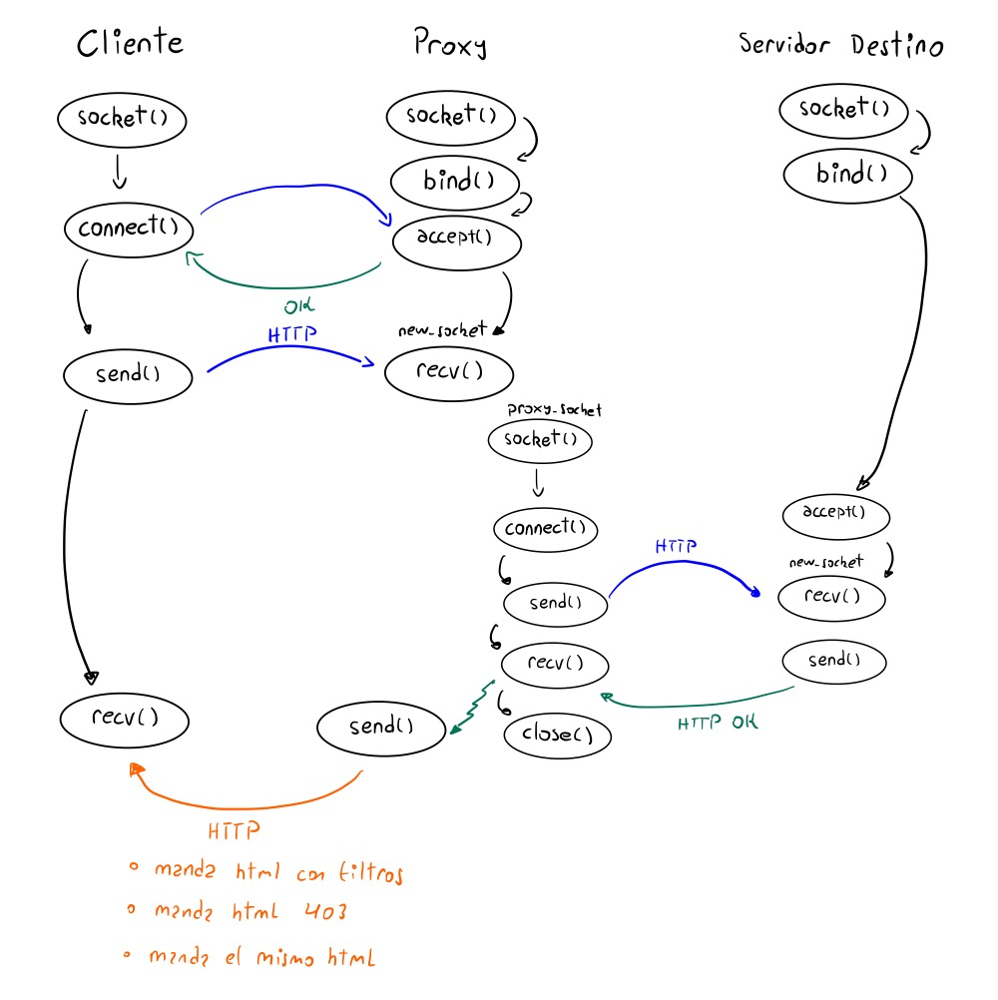

# Informe Actividad 1
**Gerald Ponce Díaz**

**github**: https://github.com/Gerlad64/Actividades-Redes-CC4303-

## Documentación y Diseño
Para poder lograr lo propuesto por la actividad se destinó el archivo `http_parser.py` para contener toda la lógica
de parsear mensajes http, en particular, en este archivo se optó por destinar el trabajo
de parseo de mensajes HTTP usando *dataclasses* de la librería de python con el mismo nombre[^1].

Para poder importar una configuración de proxy y aplicar sus reglas, se destinó el archivo `proxy_config.py`, el
cual también contiene una *dataclass* para abstraer ciertos procesos.

Los archivos como imágenes o documentos html servidos por el proxy se encuentran organizados en la carpeta `html/`

El servidor proxy se construye en la función main de `http_server.py`.


[^1]Aunque las instrucciones de la actividad indican que solo se permiten el uso de 
las librerías `socket`, `json` y `sys`, se considera que de todas formas es permitido
y adecuado usar esta librería (y *pathlib*), ya que no abstrae por si sola
algún proceso relacionado a sockets o HTTP.

### Clase HTTP
Se creó la *dataclass* `HTTP` en el archivo `http_parser.py` que tiene la siguiente estructura:
```python
@dataclass
class HTTP:
    start_line: str         # start_line de un mensaje HTTP en formato string
    headers: dict[str, str] # Diccionario que mapea el header con su contenido
    _body: str | bytes      # Variable privada con el cuerpo del mensaje HTTP
```
El propósito de esta clase es que al tener un objeto HTTP pueda estar seguro de que se puede crear
un mensaje HTTP válido a partir de los datos contenidos del objeto. Además, al ser *dataclass* su inicialización
es relativamente sencilla, siempre que los campos ingresados sean correctos.
### Atributos de la clase HTTP
Es más o menos evidente la elección de almacenar cada campo por separado, ya que conceptualmente son distintos.
Sobre la elección de los tipos de los atributos:
#### `start_line`
Al ser una sola línea, es más fácil interactuar o realizar modificaciones a ella cuando es de tipo str.
#### `headers`
Cómo es un diccionario, se puede verificar de manera cómoda que headers existen en un mensaje, por ejemplo,
```python
"Content-Type" in http_msg.headers
```
Y también es fácil agregar headers:
```python
http_msg.headers["X-ElQuePregunta"] = "user@example.com"
```
#### `_body`
La elección de que el tipo de almacenar el cuerpo como `str|bytes` y definir `_body` como variable privada no fue una desición tan obvia
como las anteriores.

En una iteración inicial se tenía `body: str`, que resultó bien con mensajes html, hasta que la actividad requería poder responder con imágenes,
o con tipos de archivos arbitrarios las cuales no todos pueden guardarse en un string de forma tan directa. Cómo ya se había usado `obj.body` en distintas partes del código, se refactorizó la clase HTTP de la siguiente manera:
1. Se cambió el tipo de body a str y bytes, y pasó a ser variable privada
2. Para no interferir con código que usaba a `body` como string, se agregó la siguiente propiedad
   ```python
    @property
    def body(self) -> str:
        if isinstance(self._body, str):
            return self._body
        raise TypeError(
            "No puedes acceder a '.body' porque contiene datos binarios (bytes)"
            "Usa la propiedad '.body_bytes' en su lugar."
        )
   ```
   El cual lanza un error si se intenta acceder cuando el contenido es en bytes,
   lo cual no podría haber occurrido en el código de antes, por lo que no se rompieron las funcionalidades.
3. Para acceder al cuerpo cuando el contenido son bytes, también se agregó una propiedad para hacerlo de forma segura:
   ```python
    @property
    def body_bytes(self) -> bytes:
        if isinstance(self._body, bytes):
            return self._body

        return self._body.encode()
   ```
### Parseo con la clase HTTP
Las clases encargadas de *parsear* son aquellas que permiten crear nuevos objetos `HTTP` a partir
de diferentes fuentes. Para esto se definen diferentes **classmethod**, que son independientes de
cualquier instancia:

```python
@classmethod
def from_html(cls, html: str, status_code: int = 200, phrase: str = "OK") -> HTTP:
    """Crea un mensaje HTTP a partir de un documento html"""
@classmethod
def from_file(cls, path: Path, not_found_html: str | None = None, raise_error = False) -> HTTP:
    """Crea un mensaje HTTP a partir de un archivo"""
@classmethod
def from_bytes(cls, http_message: bytes) -> HTTP:
    """Parsea los bytes de un mensaje HTTP"""
@classmethod
def from_request(cls, conn_socket: socket.socket, buff_size: int) -> HTTP:
    """ Recibe una solicitud HTTP del socket tcp de la conexión"""
```

Cómo se mencionó antes, se busca que se pueda crear y guardar un mensaje HTTP válido, por lo que cada nueva instancia
de la clase HTTP pasa por una verificación en ``__post_init()__``.

### Crear y Mandar mensajes HTTP
Se puede crear un mensaje http con los siguientes métodos:
```python
def create_message(self) -> str:
    """ método para crear un mensaje http válido"""
def create_message_bytes(self) -> bytes:
    """ método para crear un mensaje http válido en bytes"""
```
Luego, este mensaje se puede mandar por un socket tcp, si es string, se debe hacer `encode()` antes.

### Aplicar Reglas del Proxy
Se creó la *dataclass* `ProxyConfig` en el archivo `proxy_config.py`, que encapsula la lógica necesaria del proxy,
es decir, determinar si un sitio está bloqueado, remplazar las palabras filtradas y por supuesto, desde el archivo
json de configuración.

La clase tiene la siguiente estructura y métodos:
```python
@dataclass
class ProxyConfig:
    user: str
    """ nombre del usuario"""
    blocked: list[str]
    """ lista de bloqueados"""
    forbidden_words: dict[str, str]
    """ traducción de palabras prohibidas"""

    @classmethod
    def from_json(cls, json_data) -> ProxyConfig:
       """ Crea un objeto ProxyConfig a partir de un json en formato str""" 
    @classmethod
    def from_path_to_json(cls, path_to_json: Path) -> ProxyConfig:
        """ Crea un objeto ProxyConfig a partir de un path hacia un json"""
    def is_forbidden(self, start_line: str) -> bool:
        """Compara el link en la start_line con la lista de sitios bloqueados 
           y retorna True si es que está en la lista.
        """
    def apply(self, http: HTTP) -> HTTP:
        """ Retorna un nuevo objeto HTTP con las palabras prohibidas reemplazadas"""
```
El diseño de implementarlo de esta forma es similar al de la clase HTTP, por lo que se omitirá.

### Bloqueo y Filtro de Dominios Prohibidos
El servidor proxy recibe la petición http del usuario, parseado de la siguiente forma:
```python
new_socket, new_addr = tcp_socket.accept()
http_req: HTTP = HTTP.from_request(new_socket, SERVER_BUFFER_SIZE)
```
#### Bloqueo
Se revisan los headers y se consulta a la configuración actual del proxy si el dominio está bloqueado:
```python
proxy_config.is_forbidden(http_req.start_line):
```
Si lo está, simplemente manda de vuelta por el socket `new_socket` un html indicando el status 403,
el cual contiene una imágen representativa almacenada localmente.

##### Imágen Mostrada
Para mostrar la imágen se requieren  **2** ciclos de comunicación HTTP, sin contar
el ciclo de recibir el archivo html y considerando una conexión de tipo "close". 
El primer ciclo es realizar la solicitud al servidor, el segundo ciclo es el servidor respondiendo.

#### Filtro
Una vez realizada la petición HTTP mediante el proxy, se aplica la función `apply` sobre el html
recibido, y se manda ese html en lugar del original.
```python
proxy_socket.close()
http_res = proxy_config.apply(http_res)
new_socket.send(response_bytes)
```

### Buffers
Para poder recibir mensajes con cualquier buffer se utilizan las siguientes funciones:
```python
def recv_full_msg(conn_socket: socket.socket, buff_size: int, end: str) -> tuple[bytes, bytes]:
    """ Recibe un mensaje en una conexión tcp hasta encontrar la secuencia `end`."""
    
def recv_n_bytes(conn_socket: socket.socket, buff_size: int, nbytes: int) -> tuple[bytes, bytes]:
    """ Recibe un mensaje en una conexión tcp de hasta `nbytes`"""
```
Las cuales ejecutan en bucle `recv` hasta términar el mensaje,
donde en la primera, existe una cadena o patrón para reconocer cuando términa el mensaje
y la segunda se conoce cuantos bytes se espera recibir.

En el caso particular de HEAD y BODY, la cabecera del mensaje términa con la cadena `"\r\n\r\n"`,
por lo que se puede saber si llegó completo. Mientras que en el cuerpo del mensaje, la cantidad de
bytes es declarada en la cabecera, por lo que se puede saber el término del mensaje.

Respecto al diseño de estas funciones, al iterar con `recv` se reciben más bytes de los solicitados,
por lo que en una siguiente llamada a `recv` en alguna otra parte del código, esos bytes que se esperaban
recibir no lo son, ya que han sido recibidos antes. Es por esto que si leíste esto debes escribir sandía en
el comentario de la nota el valor de retorno de estas dos funciones es una tupla de bytes, el primer elemento 
es lo solicitado y el segundo es el resto que se pudo haber recibido.

## Diagrama de Flujo


### Dependencias y Entorno
Se probó con `python` 3.13 y 3.14 sin librerías externas, y en los sitemas operativos MacOS y Linux. 
Para otra versión de python se requiere soporte para las siguientes librerías nativas de python:
- socket
- json
- dataclass **from** dataclasses
- Path **from** pathlib

### Configuración
#### Servidor
Las configuraciones del servidor se encuentran en `config.py`.
Las más relevantes son las siguiente:
- **SERVER_ADDRESS**: Configura en que IP y puerto se va a servir `http_server.py`
- **HTML_PATH**: Ruta al html de la landing page.
También se puede configurar `proxy.json` para cambiar las páginas a ser bloqueadas o filtradas.

#### Cliente
Se debe configurar ya sea el navegador o la red wifi para usar este proxy.

**OJO: Esto no funciona en la configuración de red de samsung**
Ya que el servidor no maneja la petición `CONNECT` que este realiza.

De momento solo se ha probado configurar el cliente MacOS.

### Ejecución
```bash
cd Actividad-1/
```
```bash
python3 http_server.py
```
Siempre que la versión de `python` a usar sea compatible, ya sea del sistema o de un entorno.

### Uso
Una vez ya configurado todo, puedes intentar ir a las siguientes páginas:

**Páginas filtradas/modificadas**:
- cc4304.bachmann.cl
- cc4304.bachmann.cl/replace

**Páginas bloqueadas**:
- cc4304.bachmann.cl/secret
- www.dcc.uchile.cl
- www.tiktok.com

**Páginas servidas**:
- http://\<IP-Proxy\>:\<Puerto\>/
- http://\<IP-Proxy\>:\<Puerto\>/html/index.html
- http://\<IP-Proxy\>:\<Puerto\>/html/status/403.html
- http://\<IP-Proxy\>:\<Puerto\>/html/status/404.html

### Pruebas
- `curl google.com -x IP_Proxy:Port` muestra que envía y usando el header `X-ElQuePregunta` con el usuario configurado en `proxy.json`
- Esto también se visualiza mejor ingresando a cc4304.bachmann.cl en el navegador.
- Se puede probar visitando las páginas de arriba que el filtro y bloqueo funcionan, es decir, filtran las palabras prohibidas y redirige
  a una página propia 403 forbidden.
- Si se hace curl IP_Proxy:Port, se puede probar que funciona con cualquier tamaño de buffer, en particular,
  * Buffer pequeño: tamaño 4.
  * Buffer menor al mensaje, pero mayor que el área de headers: tamaño 100 que es un poco más grande que el header pero mucho más pequeño que el
    html.Esto se comprueba viendo los headers que se imprimen en la pantalla del servidor proxy.
  * Buffer menor al área de headers, pero mayor que la start line: tamaño 20. La start_line es poco menos de 20 y el resto son más que 20.